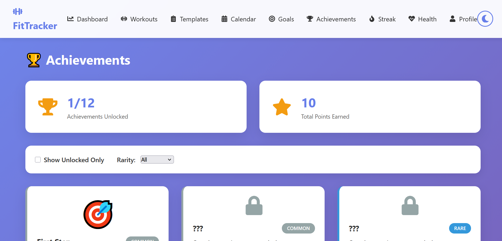

# Fitness Tracker App - Aligned with SDG 3: Good Health and Well-being

[](https://sdgs.un.org/goals/goal3)
[](https://reactjs.org/)
[](https://nodejs.org/)
[](https://www.mongodb.com/)
[](https://fitness-tracker-app-mc6o.vercel.app/)
[](https://gamma.app/docs/Fitness-Tracker-App-98m0g8172es4trc)

A comprehensive fitness tracking application designed to promote healthy lifestyles and contribute to United Nations Sustainable Development Goal 3 (SDG 3): Good Health and Well-being.

## 🌍 SDG 3 Alignment

This application directly supports **SDG 3: Good Health and Well-being** by:

- **Promoting Physical Activity**: Encouraging regular exercise through workout tracking and goal setting
- **Health Monitoring**: Tracking vital health metrics like BMI, steps, and calorie burn
- **Mental Well-being**: Providing motivational quotes and achievement systems
- **Preventive Healthcare**: Supporting users in maintaining healthy lifestyles through data-driven insights
- **Community Health**: Enabling users to share their fitness journeys and inspire others

## 📋 Table of Contents

- [Live Demo & Pitch Deck](#live-demo--pitch-deck)
- [Features](#features)
- [Technology Stack](#technology-stack)
- [Installation](#installation)
- [Usage](#usage)
- [SDG 3 Impact](#sdg-3-impact)
- [Screenshots](#screenshots)
- [API Documentation](#api-documentation)
- [Contributing](#contributing)
- [License](#license)

## 🔗 Live Demo & Pitch Deck

Experience the application firsthand and explore our business vision:

- **🌐 Live Demo**: [View the live application](https://fitness-tracker-app-mc6o.vercel.app/)
- **📊 Pitch Deck**: [View my Gamma pitch deck](https://gamma.app/docs/Fitness-Tracker-App-98m0g8172es4trc)

These resources showcase how our fitness tracker directly contributes to SDG 3 through innovative health technology.

## ✨ Features

### 🏃‍♂️ Core Fitness Tracking
- **Workout Logging**: Track various exercise types (cardio, strength, flexibility, sports)
- **Health Metrics**: Monitor BMI, steps, weight, and other vital statistics
- **Goal Setting**: Set and track fitness goals with progress visualization
- **Achievement System**: Unlock achievements and maintain streaks
- **Workout Templates**: Pre-built workout routines for different fitness levels

### 📊 Analytics & Insights
- **Dashboard**: Comprehensive overview of fitness progress
- **Progress Charts**: Visual representation of workout trends and health metrics
- **Category Analysis**: Breakdown of workouts by type and intensity
- **Streak Tracking**: Maintain and visualize workout consistency

### 🎯 Motivation & Engagement
- **Motivational Quotes**: Daily inspiration for fitness journeys
- **Goal Milestones**: Celebrate progress with milestone achievements
- **Dark Mode**: Comfortable viewing experience
- **Responsive Design**: Works seamlessly on all devices

### 🔐 User Management
- **Secure Authentication**: JWT-based user authentication
- **Profile Management**: Personalized user profiles with fitness goals
- **Data Privacy**: Secure storage and handling of personal health data

## 🛠 Technology Stack

### Frontend
- **React 18.2.0**: Modern JavaScript library for building user interfaces
- **React Router**: Client-side routing for single-page application
- **Framer Motion**: Animation library for smooth UI transitions
- **Recharts**: Data visualization library for charts and graphs
- **Axios**: HTTP client for API communication
- **React Toastify**: Notification system
- **CSS3**: Custom styling with responsive design

### Backend
- **Node.js**: JavaScript runtime environment
- **Express.js**: Web application framework
- **MongoDB**: NoSQL database for data storage
- **Mongoose**: MongoDB object modeling
- **JWT**: JSON Web Tokens for authentication
- **bcryptjs**: Password hashing
- **CORS**: Cross-origin resource sharing

### Development Tools
- **Create React App**: Build setup for React applications
- **Nodemon**: Automatic server restart during development
- **ESLint**: Code linting
- **Git**: Version control

## 🚀 Installation

### Prerequisites
- Node.js (v18 or higher)
- MongoDB (local or cloud instance)
- npm or yarn package manager

### Backend Setup

1. **Clone the repository**
   ```bash
   git clone https://github.com/your-username/fitness-tracker-app.git
   cd fitness-tracker-app/backend
   ```

2. **Install dependencies**
   ```bash
   npm install
   ```

3. **Environment Configuration**
   Copy the `.env.example` file to `.env` and fill in your actual values:
   ```bash
   cp .env.example .env
   ```

   Then update the `.env` file with your configuration:
   ```env
   NODE_ENV=development
   PORT=5000
   MONGO_URI=mongodb://localhost:27017/fitness-tracker
   JWT_SECRET=your_jwt_secret_key_here
   JWT_EXPIRE=30d
   ```

4. **Start MongoDB**
   Make sure MongoDB is running on your system.

5. **Start the backend server**
   ```bash
   npm run dev
   ```

### Frontend Setup

1. **Navigate to frontend directory**
   ```bash
   cd ../frontend
   ```

2. **Install dependencies**
   ```bash
   npm install
   ```

3. **Start the development server**
   ```bash
   npm start
   ```

4. **Access the application**
   Open [http://localhost:3000](http://localhost:3000) in your browser.

## 📱 Usage

### Getting Started
1. **Register**: Create a new account with your personal details
2. **Set Goals**: Define your fitness objectives and target dates
3. **Log Workouts**: Record your daily exercise activities
4. **Track Progress**: Monitor your health metrics and achievements
5. **Stay Motivated**: View your progress charts and motivational quotes

### Key Workflows

#### Workout Tracking
- Click "Add Workout" to log a new exercise session
- Select workout category, duration, and intensity
- View workout history and progress charts

#### Goal Management
- Set specific, measurable fitness goals
- Track progress with visual indicators
- Receive notifications for goal milestones

#### Health Monitoring
- Log daily health metrics (weight, steps, etc.)
- View BMI calculations and health trends
- Monitor calorie intake and expenditure

## 🌍 SDG 3 Impact

### Target Contributions

This application contributes to the following SDG 3 targets:

- **3.4**: By 2030, reduce by one third premature mortality from non-communicable diseases through prevention and treatment
  - Supports preventive healthcare through fitness tracking

- **3.5**: Strengthen the prevention and treatment of substance abuse, including narcotic drug abuse and harmful use of alcohol
  - Promotes healthy lifestyle alternatives to substance abuse

- **3.9**: By 2030, substantially reduce the number of deaths and illnesses from hazardous chemicals and air, water and soil pollution and contamination
  - Encourages outdoor activities and exercise in clean environments

### Health Benefits

- **Physical Health**: Regular exercise tracking leads to improved cardiovascular health, weight management, and disease prevention
- **Mental Health**: Achievement system and progress tracking boost motivation and reduce stress
- **Preventive Care**: Early monitoring of health metrics enables proactive health management
- **Community Impact**: Users can share their fitness journeys, inspiring others to adopt healthy lifestyles

### Measurable Outcomes

- **Increased Physical Activity**: Users log and maintain regular workout routines
- **Health Awareness**: Regular tracking of vital health metrics
- **Goal Achievement**: Structured goal-setting leads to measurable health improvements
- **Sustainable Habits**: Long-term fitness tracking promotes lasting healthy behaviors

## 📸 Screenshots

### Dashboard - SDG 3 Overview

*Main dashboard showing fitness progress aligned with SDG 3 goals*

### Workout Tracking

*Comprehensive workout logging interface*

### Goal Setting & Progress

*Goal management with progress visualization*

### Health Metrics Dashboard

*Health monitoring and BMI tracking*

### Achievement System

*Motivational achievement unlocking system*

## 📚 API Documentation

### Authentication Endpoints
- `POST /api/auth/register` - User registration
- `POST /api/auth/login` - User login
- `GET /api/auth/profile` - Get user profile

### Workout Endpoints
- `GET /api/workouts` - Get all workouts
- `POST /api/workouts` - Create new workout
- `PUT /api/workouts/:id` - Update workout
- `DELETE /api/workouts/:id` - Delete workout

### Health Metrics Endpoints
- `GET /api/health-metrics` - Get health metrics
- `POST /api/health-metrics` - Add health metric
- `PUT /api/health-metrics/:id` - Update metric
- `DELETE /api/health-metrics/:id` - Delete metric

### Goals Endpoints
- `GET /api/goals` - Get user goals
- `POST /api/goals` - Create new goal
- `PUT /api/goals/:id` - Update goal
- `DELETE /api/goals/:id` - Delete goal

### Achievement Endpoints
- `GET /api/achievements` - Get user achievements
- `POST /api/achievements/unlock` - Unlock achievement

## 🤝 Contributing

We welcome contributions that enhance SDG 3 alignment and improve user health outcomes!

### How to Contribute
1. Fork the repository
2. Create a feature branch (`git checkout -b feature/SDG3-improvement`)
3. Commit your changes (`git commit -m 'Add SDG 3 aligned feature'`)
4. Push to the branch (`git push origin feature/SDG3-improvement`)
5. Open a Pull Request

### Contribution Guidelines
- Ensure all new features support SDG 3 objectives
- Include proper documentation and tests
- Follow existing code style and architecture
- Add screenshots for UI changes
- Update README for new features

## 📄 License

This project is licensed under the MIT License - see the [LICENSE](LICENSE) file for details.

## 🙏 Acknowledgments

- United Nations Sustainable Development Goals
- Open source community for the amazing tools and libraries
- Fitness and health professionals for guidance on health metrics
- All contributors who help make this project better

## 📞 Contact

For questions, suggestions, or SDG 3 collaboration opportunities:

- **Email**: erickkimotho0@gmail.com
- **GitHub Issues**: [Create an issue](https://github.com/your-username/fitness-tracker-app/issues)
- **LinkedIn**: https://www.linkedin.com/in/erick-kimotho-417743324/

---

**Together, let's build a healthier world through technology and contribute to SDG 3! 💪🌍**

*This project is developed with the vision of creating positive health impacts and supporting the United Nations Sustainable Development Goals.*
